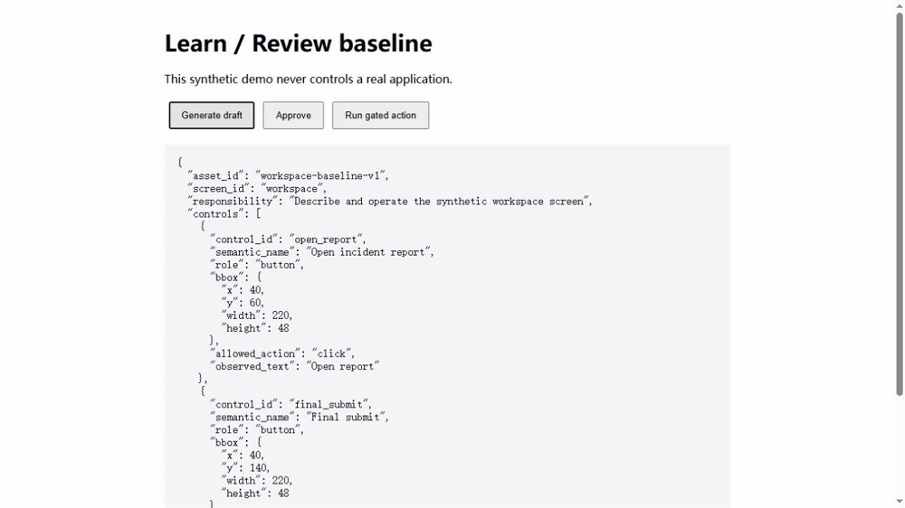
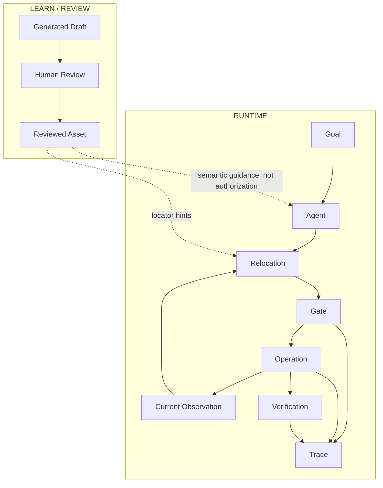
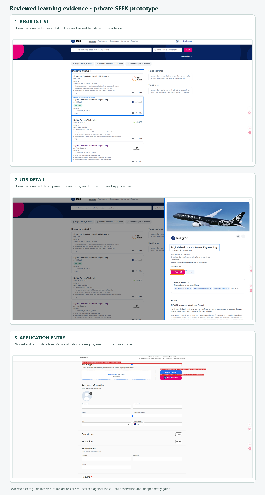

# Windows GUI Agent Runtime

[](https://www.python.org/)
[](LICENSE)
[](https://github.com/Desolate-Jix/windows-gui-agent-runtime/releases/tag/v0.1.1)
[](#project-status-and-limitations)

An early-stage reference runtime where GUI knowledge is generated, human-reviewed, reused by an Agent, relocated against the current observation, and kept behind independent Gate, Trace, and verification boundaries.

Copyright © 2026 Wenqing Ji

## Demo



The bundled deterministic demo walks through:

**Generate Draft → Human Approve → Agent Run → Current-Observation Relocation → Gate → Operation → Verification**

### What this demo proves

- Generated interface knowledge requires human review before reuse.
- Reviewed assets guide intent but never authorize execution.
- Actions are relocated against the current observation before execution.
- Stale or destructive candidates fail closed at the Gate.
- Every allowed action is traced and followed by post-action verification.

The same run produces this compact result:

```text
goal: Open the incident report
reviewed_asset: loaded
candidate: Open incident report
capture: current
gate: allowed
operation: executed
verified: true
```

## Why this exists

Screenshot-first GUI agents often repeat expensive interpretation and can blur the boundary between a learned hint and permission to act. This project separates those concerns: Learn Mode produces reusable knowledge; Agent chooses intent; Operation relocates on the current observation; Gate decides whether the action is allowed; Trace records evidence; verification checks the effect.

## Architecture



Workflow and interface assets are reusable knowledge, **not execution authorization**. The public baseline uses a deterministic synthetic adapter so it can be reproduced without accounts, private data, websites, model weights, or cloud services.

The copied `app.runtime_architecture`, `app.gate`, `modules.region`, and `modules.validation` packages expose public contracts and baseline utilities. The synthetic demo deliberately uses the smaller `app.baseline` composition root; the presence of a utility package does not imply that advanced private recognition is included or active.

## Key concepts

- **Agent** converts a goal into a semantic action using a reviewed asset.
- **Operation** owns current observation and the synthetic action adapter.
- **Gate** rejects stale, ambiguous, low-confidence, or destructive actions.
- **Trace** records the plan, candidate, decision, and post-action verification.
- **Learn/Review** creates a draft that must be reviewed before Agent consumption.

## Safety model

- Unreviewed assets cannot be consumed by Agent.
- Learned assets never authorize execution.
- Relocation uses a fresh capture identifier and current viewport; Gate rejects candidates whose capture identifier does not match the current observation.
- The click point must remain inside the current candidate bounding box.
- Destructive action vocabulary such as submit, send, confirm, payment, and delete is blocked in the baseline.
- Every allowed action produces pre-action and post-action evidence.

## Installation

```powershell
git clone https://github.com/Desolate-Jix/windows-gui-agent-runtime.git
cd windows-gui-agent-runtime
py -m venv .venv
.venv\Scripts\Activate.ps1
pip install -e ".[dev]"
```

## Quick start

Run the complete deterministic closure:

```powershell
python examples\local_demo.py
```

Expected result: a generated draft is saved, reviewed, reused by Agent, relocated against a fresh observation, allowed by Gate, executed by the synthetic adapter, traced, and verified on the resulting screen.

## Minimal Review UI

```powershell
uvicorn app.main:app --reload
```

Open `http://127.0.0.1:8000`. Generate a draft, approve it, then run the gated action. For a manual JSON review flow, run `python examples\local_demo.py --prepare-only`, edit `.oss-demo-state/generated_draft.json`, then approve it through the local page.

## Project status and limitations

This is an experimental OSS baseline, not a production automation product. The bundled demo is synthetic and deterministic. It does not claim model accuracy, general GUI reliability, autonomous operation, live website compatibility, or production readiness. Advanced private recognition, reranking, model prompts, website adapters, and real-user assets are intentionally not included.

## Relationship to the private prototype

This is not the reproducible demo shipped in this repository.

The image below is a sanitized showcase of human-corrected learning evidence from a larger private Windows GUI agent prototype. It shows three saved SEEK interface states: a results list, a selected job detail, and the no-submit application entry. These are reviewed interface assets, not a recording of an autonomous run and not execution authorization.



The private prototype explores OCR/UIA/VLM-based perception, advanced recognition and reranking, workflow-specific adapters, model-assisted decisions, and real Windows GUI execution. Those implementations, prompts, configurations, real-user data, website-specific integrations, and advanced heuristics are intentionally not included here.

The public repository focuses on the reusable architectural core: reviewed interface knowledge, current-observation relocation, independent execution gating, traceability, and post-action verification. The evidence above is not a claim of accuracy, production readiness, autonomous application capability, or live safe-fill reliability.

SEEK trademarks and page content belong to their respective owners and are shown only to illustrate the private prototype. These assets are not part of the reproducible OSS baseline and are not distributed as training data.

## Roadmap

- Add a replaceable screenshot/OCR/UIA observation adapter.
- Add a baseline Windows locator without weakening the Gate contract.
- Expand reviewed-asset editing and schema validation.
- Add reproducible fixtures and failure-oriented benchmarks.

## Contributing

See [CONTRIBUTING.md](CONTRIBUTING.md). Security issues should follow [SECURITY.md](SECURITY.md).

## License

The project's original public code is licensed under the GNU Affero General Public License v3.0 only (`AGPL-3.0-only`). See [LICENSE](LICENSE). Third-party dependencies retain their own licenses; see [THIRD_PARTY_NOTICES.md](THIRD_PARTY_NOTICES.md).
